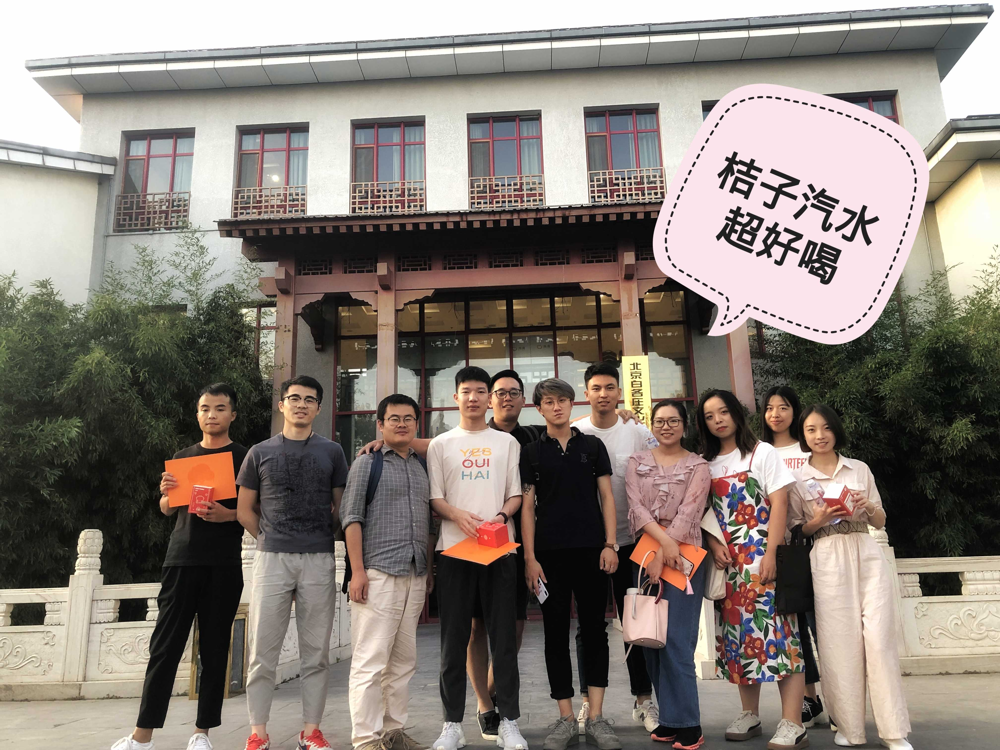
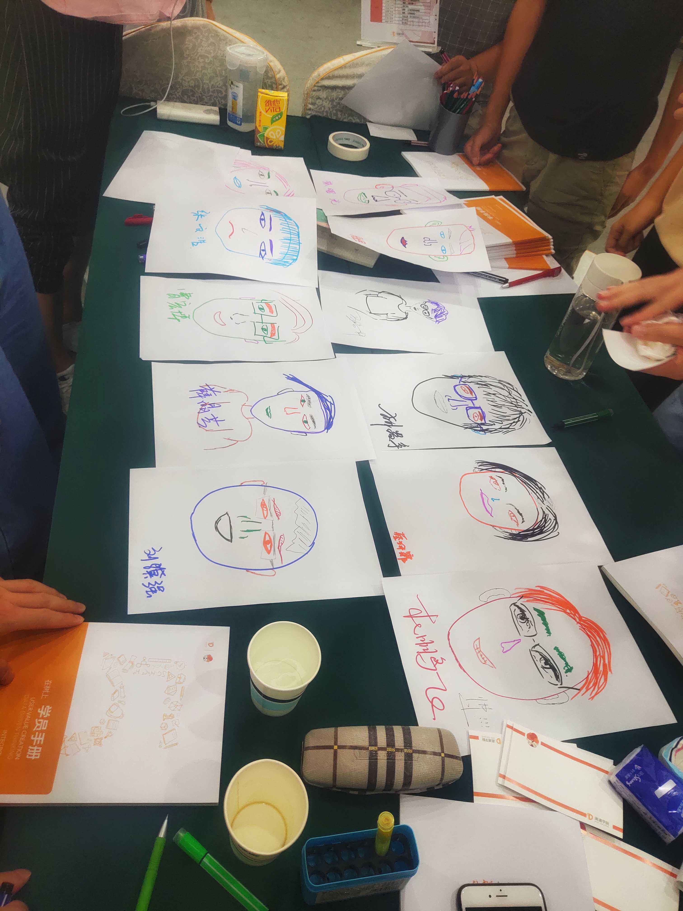
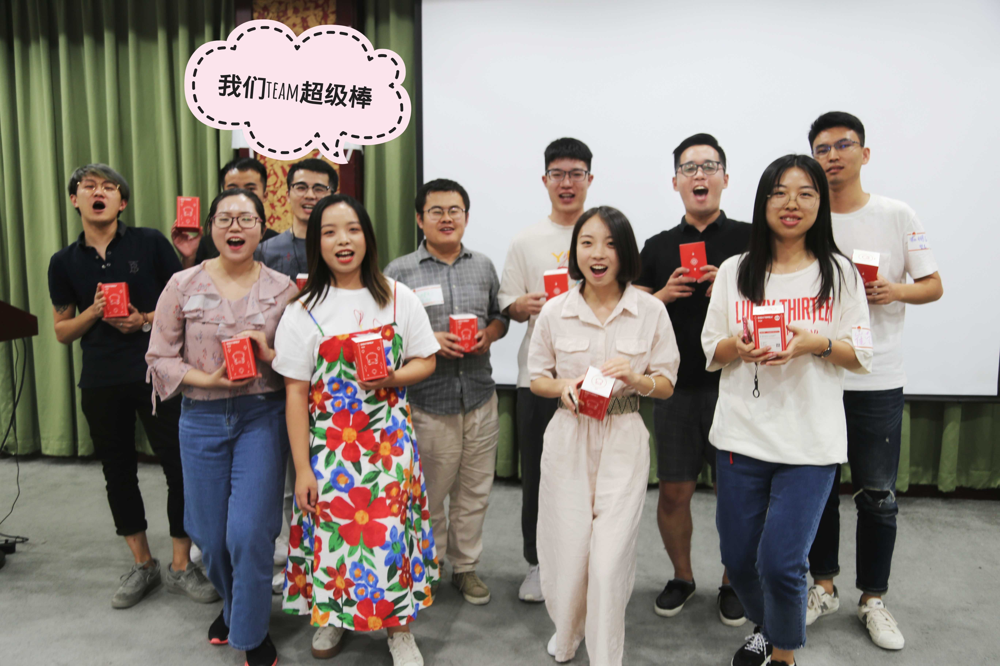

2019 年 29、30 号两天，有幸参加了在树上的活动，很开心这两天在北京遇到了有趣的朋友，接触了好玩的游戏，学习了有用的课程，遂于30号晚，机场，打开电脑，记录一下我印象中的这次难忘经历

#### 有缘人和队长
刚开始，所有的人都很陌生，坐在一起不知道聊些什么，于是班主任让大家按照生日月日从小到大，大家排排站，从头开始大家依次介绍，然后报数分组，我很荣幸被分到了 3 组，我们组一共是 11 个人，我、光哥、轩哥、强哥、梁哥、飞哥、宇哥、薛总、蔡总、崔总、张总，我记得我们的组名是飞哥起的，他说现在是夏天，大家都喜欢喝汽水，我们都是小桔子，就叫桔子汽水吧，然后大家七嘴八舌，最后把组名定为桔子汽水超好喝。然后我们进行了 8 分钟的约会，小组内大家介绍自己，最后我因为责任感的标签被大家选为了队长，其实说实话我当时真的没有相当队长的想法，可能我跟大家有缘，也跟这个队长有缘，哦对，这个队长就是桔子头，还有一个桔密，张总

#### 上课
印象最深的是海茹姐讲的课，介绍了滴滴的前世今生，课程很生动很有趣，最开始听她说话我觉得她是东北人，因为东北口音真的很重，后来才知道她是河北人，一个没有架子的河北人，让我感触最深的是，她说她是草根，一个月在北京拿 5000 块钱跟着 will 去创业，拥挤的办公室、用 A4 纸都要报备的拮据财政、每天只睡 3 小时、寒冬腊月的去火车站做推广，看不到希望但心中一直有一股执念，正是这股执念吧，让他们坚持了下去，这不禁让我想起缝纫机乐队里大鹏说的那句话

> 心里还有那口气儿，每天惦记的是什么时候开始 
> 卸下那口气儿，每天惦记的就是什么时候结束

我以前也经历过创业，很理解他们的辛苦努力换来了成功的那种感觉，虽然我没有成功过，但我知道我做的东西有人用、有客户给了它好的口碑，我就觉得很开心，觉得自己的努力没有白费，就好像自己的小孩子被人夸奖的那种感觉；所以说，滴滴是大家辛苦地养育了一个好孩子，我为它高兴

#### 桔厂小孩
每个培训的队伍在最后要提交一份毕业设计 - 我们都是体验卫士，可以是歌曲、情景剧等等不限形式，其实直到最后一天的中午大家才把方案定下来，我们做点有新意的，上台去唱我们自己改编的歌，桔厂小孩（改编自刘德华的笨小孩，轩哥提议的真好），我来负责改歌词，开始的时候一点思路都没有，后来飞哥给我开了个头，我就思绪如泉涌，已发不可收拾，于是写下了

>桔厂小孩 
 
轩： 
哦 宁静的后厂村 
有一群小桔人 
出生在这个年代 
来到了这城市 
不怕那太阳晒 
努力在 2012 
发现啊 城市里朋友们都很难打车 
要改变这时代 
 
博： 
哦 转眼间这么快 
这一群小桔人 
经过了这个时代 
几十岁熬白头 
加过班挨过累 
创造了滴滴时代 
最明白 这几年吃得苦只有自己懂 
我相信 未来不坏 
 
合： 
哎哟 往着胸口拍一拍呀 勇敢站起来 
不用心情太坏 
哎哟 向着天空拜一拜呀 别想不开 
老天自有安排 
 
强： 
哦 乘客说滴滴里 
定位差等车慢 
对我们很多期待 
司机说滴滴里 
路线差派单少 
搞得客服很无奈 
我明白 我们还有很多的不足存在 
小桔人 加油去爱 
 
合： 
哎哟 往着胸口拍一拍呀 勇敢站起来 
不用心情太坏 
哎哟 向着天空拜一拜呀 别想不开 
老天自有安排 
哎哟 往着胸口拍一拍呀 
勇敢站起来 
管它上山下海 
哎哟 向着天空拜一拜呀 别想不开 
老天自有安排 
老天爱 桔厂小孩 

我知道，在我们上台的那一刻，我们就会嗨翻全场，其实我全场一直在喊，台下的观众，灯光，表情，歌声是什么样我都不知道，只有拼命的喊，大家一起拼命的喊，不是为了第一名，这是为了我们的歌曲，我们的感情，最后我得嗓子喊哑了，我知道他们也是，最后不负众望，拿了个第一名，给团队的各位点赞！

#### 喝酒
敬请期待...

#### 忆

---

---

---

桔子汽水的故事 未完待续...
